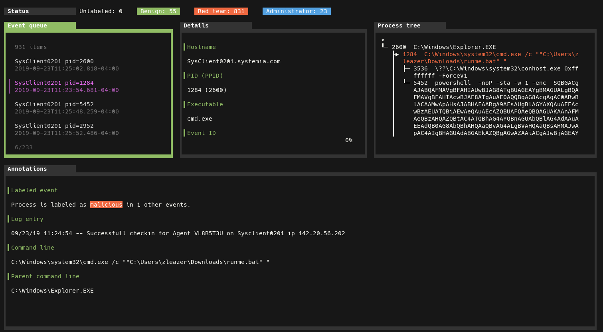

# OpTC dataset labels

<p align="center"></p>

The source code repository for the article:

> [Effective IDS under constraints of modern enterprise networks: revisiting the OpTC dataset](https://ieeexplore.ieee.org/document/10757066) \
> *10.1109/CIoT63799.2024.10757066*

In addition to the original source code and the dataset labels, it contains the
supplementary material and documentation that were developed after the
publication of the article.

## 🎯 Labels

The labelled events are included in the `labels/` directory. Review the
[how to use](/supplementary/how-to.md) page for usage instructions.

## Article abstract

> The lack of high-quality public datasets is a major obstacle for the creation
of practical and effective intrusion detection systems.  Hundreds of new
publications dedicated to this topic are released every year, but the majority
of researchers have to rely on industry partners to get access to proprietary
datasets, or use a handful of _traditional_ synthetic datasets, such as KDD99
or CIC-IDS2017.  Due to their age, simplicity and represented attacks, these
datasets cannot contribute to the detection of intrusions in modern
environments.  At the same time, newer, advanced datasets, such as OpTC, have
been almost entirely ignored by the scientific community.  Due to the enormous
volume and almost complete lack of documentation, only few authors were able to
leverage it for the evaluation of their IDS designs.  In this work, we aim to
make the OpTC dataset more accessible for modern IDS research by pointing out
methodology flaws in prior art, designing a repeatable and documented labeling
process, and building the baseline of the environment.

## Supplementary material

- [Appendix A](/supplementary/article-appendix-A.pdf): Example of the ground truth labeling
- [Errata](/supplementary/errata.md)
- [How to use this repository](/supplementary/how-to.md)
- [Description of assigned labels](/supplementary/labels.md)
- [Annotated ground truth](/supplementary/ground-truth.md)
- [Related work](/supplementary/related.md)

## Disclamer

The authors of this work are not affiliated with DARPA or the team behind the
OpTC dataset.  The data in this repository is the result of our own research
and does not constitute the official documentation of the dataset.  The data is
released as-is. The authors make no guarantees regarding the correctness,
accuracy, or usefulness of the released data.

- The original source code in this repository is released under the **[AGPL-3.0](https://www.gnu.org/licenses/agpl-3.0.en.html)** license.
- Supplementary materials are published under the terms of **[CC BY-SA 4.0](https://creativecommons.org/licenses/by-sa/4.0/)**.
- The reproduced parts of the OpTC dataset are in the public domain, according to the original terms and conditions of the [OpTC dataset](https://github.com/FiveDirections/OpTC-data). The labeling tasks and the generated labels are released into the public domain, as well.

```
@INPROCEEDINGS{10757066,
  author={Nikulshin, Victor and Talhi, Chamseddine},
  booktitle={2024 7th Conference on Cloud and Internet of Things (CIoT)},
  title={Effective IDS under constraints of modern enterprise networks: revisiting the OpTC dataset},
  year={2024},
  pages={1-8},
  keywords={Measurement;Industries;Intrusion detection;Documentation;Labeling;Object recognition;Internet of Things;Computer security;Next generation networking;Synthetic data;intrusion detection;IDS;OpTC;red team;APT;dataset;baseline},
  doi={10.1109/CIoT63799.2024.10757066}
}
